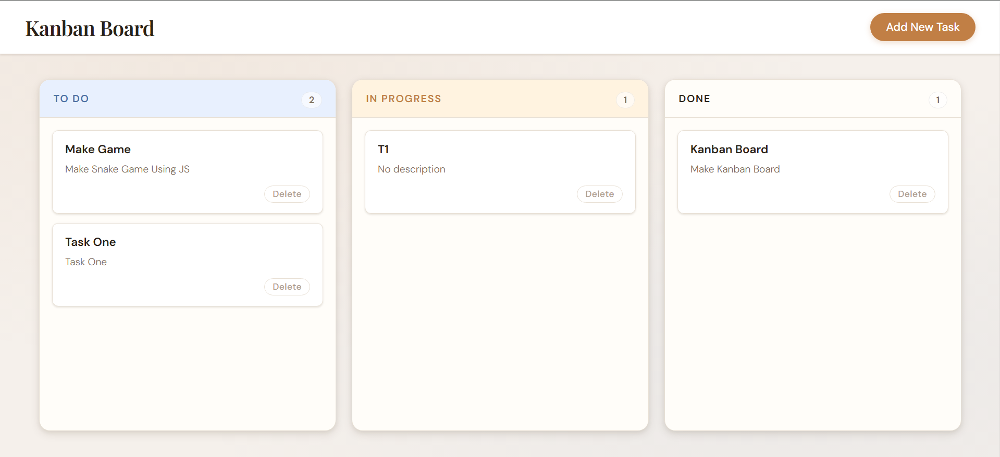
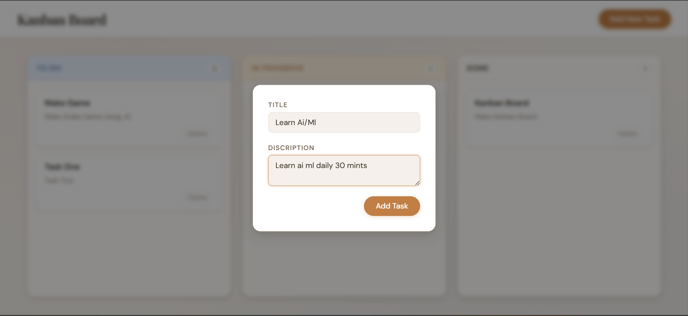
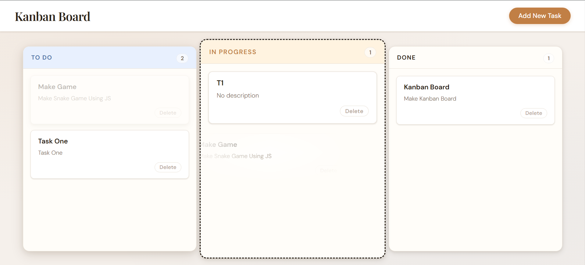
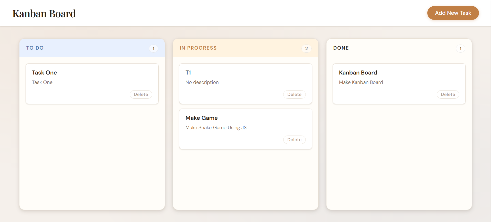

# 🗂️ Kanban Board

A simple and interactive **Kanban Board** built using **HTML, CSS, and JavaScript** to manage tasks efficiently.
This app allows users to organize tasks visually and stores data using **LocalStorage**, so tasks remain saved even after refreshing the page.

---

## 🚀 Features

* Add new tasks
* Edit existing tasks
* Delete tasks
* Drag & drop between columns
* Task status tracking (To Do, In Progress, Done)
* Data persistence using LocalStorage
* Clean and responsive UI

---

## 🛠️ Tech Stack

* HTML5
* CSS3
* JavaScript (Vanilla JS)
* LocalStorage API

---

## 📂 Project Structure

```
📁 Kanban-board
 ├── asset/
 │    ├── add-task.png
 │    ├── dashboard.png
 │    ├── drag-task.png
 │    └── drop-task.png
 ├── index.html
 ├── style.css
 ├── script.js
 └── README.md
```

---

## 📸 Screenshots

### 🖥️ Dashboard



### ➕ Add Task



### 🔄 Drag Task



### 📥 Drop Task



---

## 💾 How Data is Stored

This project uses **LocalStorage** to store tasks.

* Tasks are saved in the browser
* Data persists even after page refresh
* No backend required

Example structure:

```js
{
  todo: [],
  progress: [],
  done: []
}
```

---

## ⚙️ How to Run

1. Clone the repository

```
git clone https://github.com/dev-naresh608/Kanban-board.git
```

2. Open `index.html` in your browser

---

## 📌 Future Improvements

* User authentication
* Backend integration (Node.js + MongoDB)
* Real-time collaboration
* Mobile optimization

---

## 🙌 Author

**Naresh Chaudhary**

---

## ⭐ If you like this project

Give it a star ⭐ on GitHub
